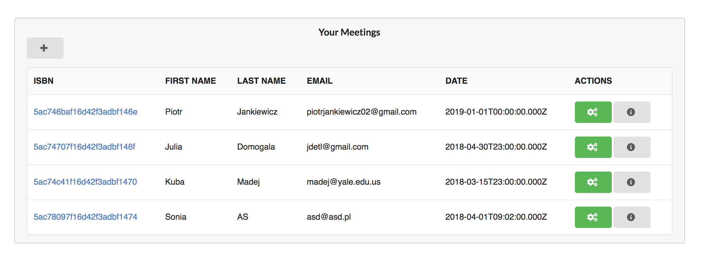
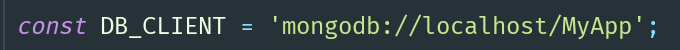

# Meetings CRUD

1) clone repository
2) install node packages `npm i`
3) update database credentials in `config/config.js` for mongoDB (install mongo db [here](https://gist.github.com/nrollr/9f523ae17ecdbb50311980503409aeb3) )

4) compile bundles with `npm run build` / `yarn build`
5) run node express server: `npm start`
6) Go and see [http://localhost:3000](http://localhost:3000) !
7) *And additionally* : run tests with `yarn test`
#### Technologies (MVC): Ķ

- MongoDB (mongoose)
- Express (express-validator, controllers, routes, views engine - it uses views created  by htmlwebpackplugin)
- ReactJs (redux, react-router-redux, react-semantic-ui)
- Webpack 4 
- Jest & Enzyme testing
 